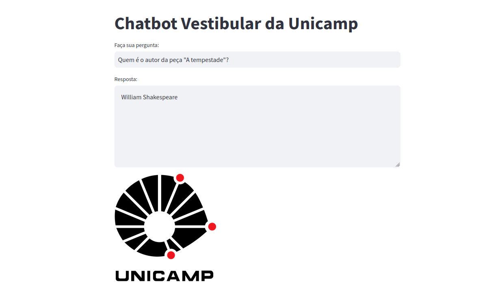

# Chatbot Neuralmind
Projeto da Neuralmind de um chatbot para responder perguntas sobre o Vestibular da Unicamp. Site oficial da PG está nas referências.


Uso
-----
Primeiro, instale as dependências necessárias
```
pip install -r requirements.txt
```
Em seguida, é possível rodar o chatbot localmente com:
```
streamlit run main.py
```
Para submeter o chatbot ao questiónario de teste, coloque sua chave da API-OpenAI em ```.env``` e rode:
```
python3 eval.py
```

Implementação
-----
A implementação é baseada no **RAG (Retrieval-Augmented Generation)**, processo de NLP usado principalmente para tarefas de Q&A. Nesse projeto, realizamos a recuperação do texto (retrieval de uma fonte confiável) e geração da resposta baseada nessa busca. 

Construção de uma fonte de conhecimento confiável:
-----
O ChatGPT auxiliou na escrita de um parser do site da PRG-Unicamp usando beutifulSoup. O parser acessa o link e transcreve os textos (e tabelas) corretamente para o arquivo output.txt. Obs: Tem apenas 2 imagens no site que tiveram que ser tratadas com atenção: as duas eram fórmulas matemáticas e foram passadas manualmente para o arquivo de saída). Olhe ```fetch.py``` para mais detalhes.

Construção do database de teste:
-----
Agora, utilizamos o arquivo da fonte de conhecimento e separamos em blocos de aproximadamente 500 linhas (tomando cuidado para não cortar conteúdos ou tabelas pela metade). Assim, com blocos que englobam assuntos similares, subtemos no ChatGPT cada arquivo desse e pedimos para ele escrever perguntas-respostas no estilo questionário na formataçao desejada. Após a geração, manualmente checamos as respostas para garantir a coerência e a confiabilidade do questionário. Com esse processo, rapidamente conseguimos um set grande de perguntas-respostas para testar o chatbot. Em seguida, testamos o chatbot com blocos e overlaps de tamanhos diversos, além de diferentes métricas para avaliar a distância entre a resposta prevista e a correta. A maior parte dessas funções de distâncias entre strings utilizava os embeddings da OpenAI (já normalizados [0,1]), em particular, cosine similarity e dist. euclidiana. Olhe a seção **Evaluation** para mais detalhes.

Evaluation:
-----
A melhor acurácia foi obtida com blocos de tamanho 900, overlap de 250 e usando cosine similarity como evaluator : **Acc. 90.36%**

Blocos de tamanho 900, overlap 250
* Métrica Cosine Similarity : **0.90369**
* Métrica Distância Euclidiana : 0.60049
* Métrica Distância Manhattan: 
* Métrica Naive (porcentagem da prediction contida na resp. correta) : 0.75019

Blocos de tamanho 1000, overlap 200
* Métrica Cosine Similarity : 0.89263
* Métrica Naive : 0.7456462

Blocos de tamanho 1200, overlap 200
* Métrica Cosine Similarity : 0.89451
* Métrica Naive : 0.6648486

Blocos de tamanho 800, overlap 150
* Métrica Naive : 0.6415037

Nice TODO
-----
* Testar outros string evaluators e analisar o comportamento (eg.: scoring eval, edit dist.)
* Criar um questionário de perguntas maior (eg.: perguntas mais complexas)
* Analisar outros retrievers (eg.: MultiQueryRetriever, MultiVectorRetriever)

Referências
-----
* https://www.pg.unicamp.br/norma/31594/0
* https://python.langchain.com/docs/use_cases/question_answering/
* https://python.langchain.com/docs/guides/productionization/evaluation/string/embedding_distance/
